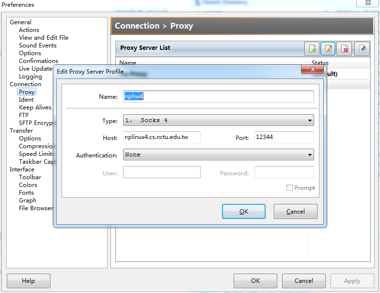

# proxy server 

使用 SOCK4 协议 实现一个简单的代理服务器

支持 connect 和 bind 模式

## 防火墙规则

程序执行指令格式为

    ./server [port] [rule]

`rule` 为0代表可以访问任意ip， 没有防火墙限制。
`rule` 为1代表只能访问以 114.113 (nctu 内部网络) 开头的ip
`rule` 为其他代表只能访问以 140.114 (nhtu 内部网络) 开头的ip

## connect mode

测试步骤

1. 设置谷歌浏览器 proxy 代理ip, port 为本程序运行所在机器的ip 与 port
2. 可以浏览任意页面
3. 终止执行程序，浏览器无法访问任何页面

## bind mode

使用 flashfxp active port，测试代理服务器的中转功能。

flaskfxp 设置步骤：

## 额外实现功能

现场改代码实现：对任意文件，只向 ftp server 上传 512k 大小。

